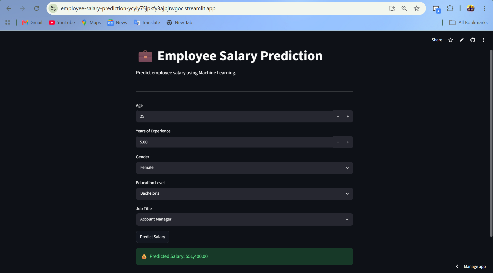

## Application Preview

# 💼 Employee Salary Prediction Using Machine Learning

## 📌 Project Overview

This project predicts employee salaries based on demographic and professional attributes using Machine Learning.

The objective is to help organizations estimate compensation levels based on factors such as age, education, experience, gender, and job title.

---

## 🚀 Features

* Exploratory Data Analysis (EDA)
* Data Cleaning and Preprocessing
* Categorical Encoding
* Linear Regression Model
* Random Forest Regressor
* Hyperparameter Tuning
* Feature Importance Analysis
* Streamlit Web Application
* Model Persistence using Joblib

---

## 📊 Dataset Features

| Feature             | Description               |
| ------------------- | ------------------------- |
| Age                 | Employee age              |
| Gender              | Male/Female               |
| Education Level     | Bachelor's, Master's, PhD |
| Job Title           | Employee designation      |
| Years of Experience | Total work experience     |
| Salary              | Target variable           |

---

## 🛠️ Technologies Used

* Python
* Pandas
* NumPy
* Matplotlib
* Seaborn
* Scikit-learn
* Streamlit
* Joblib

---

## 🤖 Machine Learning Models

### Linear Regression

Used as a baseline regression model.

### Random Forest Regressor

Used to capture non-linear relationships and improve prediction performance.

---

## 📈 Evaluation Metrics

* Mean Absolute Error (MAE)
* Root Mean Squared Error (RMSE)
* R² Score

---

## 🖥️ Streamlit Application

The application allows users to:

* Enter employee information
* Select education level and job title
* Predict salary instantly using the trained model

---

## 📂 Project Structure

Employee_Salary_Prediction/

├── app.py

├── random_forest.pkl

├── gender_encoder.pkl

├── education_encoder.pkl

├── job_encoder.pkl

├── Salary Data.csv

├── requirements.txt

└── README.md

---

## 📌 Future Improvements

* XGBoost Integration
* Salary Range Prediction
* Cloud Deployment
* Interactive Analytics Dashboard

---

## 👩‍💻 Author

**Nupur Shah**

Machine Learning Enthusiast | Data Analytics | AI Applications

GitHub: https://github.com/nasaAt31